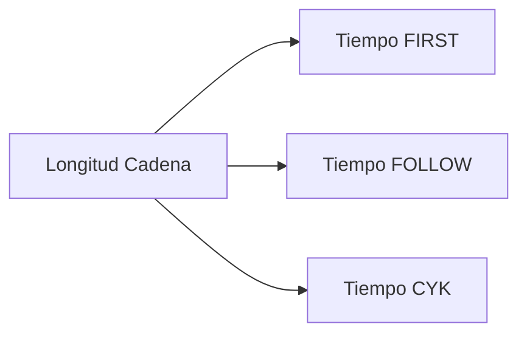

### 👋 Hola

## 📘 Descripción General

Este repositorio contiene herramientas en Python para el **análisis avanzado de gramáticas libres de contexto**, desarrolladas como soporte para una investigación académica. Incluye implementaciones eficientes de:

- Cálculo de conjuntos **FIRST**, **FOLLOW** y **PREDICT**
- Algoritmo **CYK** (Cocke-Younger-Kasami)
- Sistema de **medición de rendimiento**
- **Visualización** de datos gramaticales

---

## 🛠 Herramientas Incluidas

| Archivo           | Funcionalidad Principal                                           |
|------------------|-------------------------------------------------------------------|
| `graf.py`         | Análisis completo FIRST/FOLLOW/PREDICT con gráficos combinados   |
| `primSigPred.py`  | Versión alternativa con gráficos individuales                    |
| `Graficas.py`     | Implementación CYK con análisis de rendimiento                   |

---

## 📦 Requisitos Previos

- **Python 3.8+**
- Instalación de dependencias:
  
  ```bash
  pip install matplotlib numpy
  ```

---

## 🚀 Instalación y Uso

1. **Clona el repositorio**
  
   ```bash
   git clone <URL-del-repo>
   cd <nombre-del-repo>
   ```

2. **Prepara tu gramática en el archivo `gramatica.txt`**

   Ejemplo:
   ```txt
   S -> NP VP
   NP -> Det N | Det N PP | Det Adj N
   VP -> V NP | V NP PP | V
   PP -> P NP

   Det -> 'el' | 'la' | 'un' | 'una' | 'los' | 'las'
   N -> 'gato' | 'perro' | 'niño' | 'niña' | 'casa' | 'pelota' | 'historia' | 'cuento' | 'persona' | 'mundo'
   Adj -> 'grande' | 'pequeño' | 'bonito' | 'triste' | 'feliz' | 'rápido' | 'lento' | 'hermoso'
   V -> 'corre' | 'juega' | 'salta' | 'lee' | 'escribe' | 've' | 'escucha' | 'habla'
   P -> 'en' | 'con' | 'sobre' | 'bajo' | 'junto a'

   # Frases adicionales para dar variedad
   S -> S Conj S
   S -> 'Era una vez' NP 'que' VP '.'
   S -> 'Un día' NP 'fue' VP '.'

   Conj -> 'y' | 'o' | 'pero'
   ```

3. **Ejecuta los análisis**

   - Análisis gramatical:
     ```bash
     python graf.py
     ```

   - Análisis CYK:
     ```bash
     python Graficas.py
     ```

---

## 🧪 Cadenas de Pruebas

Se utilizó el siguiente **microrrelato** para pruebas de rendimiento:

> "En un pequeño mundo, un gato feliz corre junto a un niño.  
> Juntos, juegan con una pelota grande en el parque.  
> La niña, que observa desde la casa bonita, también quiere unirse a la diversión.  
> Ella juega con su perro y cuenta historias sobre un mundo mágico.  
> Mientras tanto, el gato escucha atentamente, con sus ojos brillantes."

**Longitudes específicas analizadas**:

- 109 caracteres (inicio del relato)  
- 216 caracteres (primera mitad)  
- 326 caracteres (75% del texto)  
- 542 caracteres (texto completo)

---

## 📊 Resultados y Visualización

Cada ejecución genera:

- **Salida en consola** con métricas precisas
- **Gráficos PNG**:
  - Comparativa FIRST/FOLLOW/PREDICT
  - Tiempos de ejecución CYK
  - Análisis de escalabilidad

---

## 📍 Ejemplo de Salida

```text
Tiempo FIRST (109 chars): 0.0042s  
Tiempo FOLLOW (109 chars): 0.0078s  
Tiempo CYK (216 chars): 0.0345s
```

---

## ⚙️ Personalización

Para modificar las pruebas:

- Edita la variable `cadena_usuario` en los scripts.
- Ajusta los rangos en `Graficas.py`:

  ```python
  additional_strings = [texto[:i] for i in [109, 216, 326, 542]]
  ```

---

## 📈 Interpretación de Resultados

### Patrones esperados de complejidad temporal:

- **FIRST**: Lineal — `O(n)`
- **FOLLOW**: Cuadrática — `O(n²)`
- **CYK**: Cúbica — `O(n³)`

### Relación longitud-tiempo


